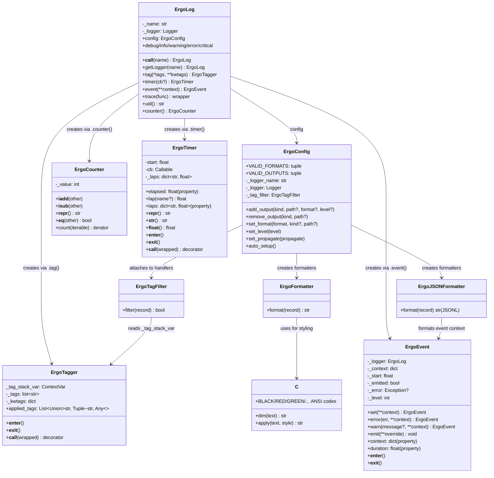

# Core — API & Architecture

## Module Structure

Single-file library: `src/ergolog/ergolog.py` contains all implementation.

## Key Behaviors

### Named/Child Loggers
- `eg('name')` → logger `ergo.name`
- `eg('name')('child')` → logger `ergo.name.child`
- `eg()` returns the root logger
- Loggers are cached in `ErgoLog._loggers`

### Tag System
- `ErgoTagger._tag_stack_var` is a `contextvars.ContextVar` — each thread and async task gets its own isolated tag stack
- Tags nest: entering a tag `set()`s a new stack, exiting `reset(token)`s to the previous snapshot
- Keyword tag values can be callables (zero-arg, returning a string) — called at `__enter__` time to generate the tag value
- `eg.uid` is a static method returning a 6-char hex UUID — the idiomatic callable for `eg.tag(job=eg.uid)`
- No magic tag names — `'job'` is not special; auto-generated IDs use the callable mechanism instead
- Tags are injected onto `LogRecord` by `ErgoTagFilter`, not by the formatter — any formatter can access `record.tags` and `record.tag_list`
- `record.tag_list` is the raw list of tag strings (for structured/JSON logging); `record.tags` is the formatted display string (for pretty output)
- The `set()/reset()` pattern eliminates `list.remove()` corruption bugs that occurred with a shared mutable list

### Wide Events (ErgoEvent)
- Not thread-safe — `_context` is a plain `dict` with no locking
- This is by design: events are born, populated, and emitted within a single scope/thread
- The wide-event pattern (`with eg.event(...) as e:`) is inherently single-threaded — you accumulate context for one operation and emit at the end
- Tags provide the cross-thread/cross-async safety story (`contextvars`); events don't need to because they're never shared
- `eg.event(**context)` creates an accumulator for wide event logging
- Accumulates context via `e.set(**context)` until `emit()` is called
- Can be used as context manager (auto-emit on exit) or manually (`e.emit()`)
- Captures duration automatically in `event['duration_s']`
- Captures current tag stack at emit time in `event['tags']`
- Errors can be recorded via `e.error(err, **context)` — sets level to ERROR
- `e.warn(message?, **context)` — sets level to WARNING, optionally records a warning message and context
- After `emit()`, further calls to `set()` are ignored (sealed)
- Works with `ErgoJSONFormatter` for structured JSONL output

### Config (ErgoConfig)
- `eg.config` is an `ErgoConfig` instance attached to the `ErgoLog` singleton
- Replaces the old module-level `config` dict (which was a dead letter after import)
- `dictConfig` is no longer exposed — `ErgoConfig` manages handlers directly
- **Auto-setup on import**: adds a stdout handler with `ErgoFormatter` unless `ERGOLOG_NO_AUTO_SETUP=1` or the logger already has handlers
- **Env vars** (all "emergency brake" style — prevent something):
  - `ERGOLOG_NO_COLORS` — strip ANSI output
  - `ERGOLOG_NO_TIME` — strip timestamps
  - `ERGOLOG_NO_AUTO_SETUP` — don't configure any handlers on import
- **Python API**:
  - `eg.config.add_output(kind, path?, format?, level?)` — add a handler (stdout, stderr, file)
  - `eg.config.remove_output(kind, path?)` — remove a handler
  - `eg.config.set_format(format, kind?, path?)` — change formatter on a handler
  - `eg.config.set_level(level)` — change log level
  - `eg.config.set_propagate(bool)` — control propagation to root logger
- **Valid formats**: `'default'` (colored), `'plain'` (no ANSI), `'json'` (JSONL)
- **Valid outputs**: `'stdout'`, `'stderr'`, `'file'`
- File output always uses append mode
- Calling `add_output()` with the same kind replaces the existing handler
- `ErgoTagFilter` is attached to every handler created by `ErgoConfig`
- Both formatters are always available — `set_format('json')` swaps without recreating the handler

### Counter/Accumulator
- `eg.counter()` creates an `ErgoCounter` instance (starts at 0)
- Supports `+=` (increment/accumulate), `-=` (decrement), `==` (comparison to int or other counter)
- `.count(iterable)` wraps iteration and auto-increments each loop
- As a tag kwarg value, evaluated per-record (shows current value on each log line, unlike `eg.uid` which is evaluated once on enter)
- `ErgoCounter` objects are stored as `tuple(key, counter)` on the tag stack; the filter formats them at log time

### Timer
- Can be used as context manager or decorator
- Optional callback receives formatted elapsed string
- `.elapsed` property returns current elapsed time as float
- `.lap()` returns current elapsed as float without stopping the timer
- `.lap('name')` returns elapsed AND records a named lap in `_laps` dict
- `.laps` property returns a (copy) dict of named laps: `{name: elapsed_float}`
- Re-entering a timer context resets `_laps`
- Usable as tag value: `with eg.tag(elapsed=t)` — shows dynamic elapsed per log line (e.g. `[elapsed=0.123s]`)
- Usable as event value: `e.set(duration=t)` — resolves to total elapsed at emit time
- When timer is an event value, its named laps are auto-collected into the event context

### Composability (Events + Counters + Timers)
- Counters and timers passed to `e.set()` are stored by reference, evaluated at emit time
- Counter in event: `e.set(count=counter)` → event shows `counter._value` at emit time
- Timer in event: `e.set(duration=t)` → event shows `t.elapsed` at emit time
- Named laps auto-collected: if timer has `_laps`, they're merged into the event context
- `e.set(fetch=t.lap())` also works for explicit control — `t.lap()` returns a float, not a timer reference
- Explicit lap values (floats) are stored as plain values; they don't trigger auto-lap collection

### Trace Decorator
- Logs function name and timing by default (safe for production)
- `@eg.trace(log_args=True)` opts into logging arguments and return values (for local debugging only)
- `@eg.trace()` requires parens — no bare `@eg.trace`
- Wraps function with both `tag` and `timer`
- Equivalent to `@eg.tag(trace=func.__name__)` + `@eg.timer()`

### JSON Formatter (ErgoJSONFormatter)
- Outputs each log as a JSON object on a single line (JSONL/NDJSON)
- Includes: `timestamp`, `level`, `name`, `message`, `tags`, `event`, `duration_s`, `location`
- For wide events, `event` contains the full accumulated context
- For regular logs, `tags` contains the tag stack as a dict
- Usage: `eg.config.add_output('stdout', format='json')` or `eg.config.set_format('json')`

## Invariants
- `ErgoLog._loggers` key is always the fully-qualified logger name (e.g. `ergo.sub`)
- Tag stacks are context-isolated via `contextvars.ContextVar` — no cross-thread or cross-task leakage
- `set()/reset(token)` ensures tags are always cleaned up on context exit, even on exceptions
- `ErgoTagFilter` must be present on any handler that needs `record.tags` — custom configs must include it
- `ErgoConfig` attaches `ErgoTagFilter` to every handler it creates
- Color output is all-or-nothing per process (env var check at import time)
- `ErgoEvent` emits exactly once; after `emit()` the event is sealed and further `set()` calls are ignored
- Wide events capture tag stack at emit time, not at creation time
- Counters and timers in events are stored by reference and evaluated at emit time (live values)
- Named laps on timers in events are auto-collected into event context at emit time
- `ErgoEvent._context` is a plain dict — events are single-threaded by design (born/populated/emit within one scope)
- `ErgoConfig.add_output()` creates handlers via Python `logging` API directly, not via `dictConfig` — no destructive reconfiguration
- Auto-setup only fires once, and only if the logger has no existing handlers