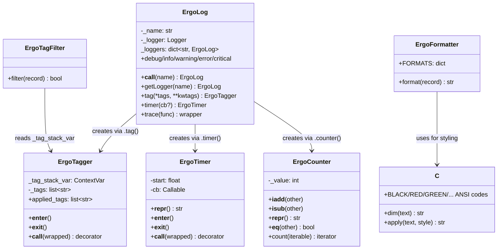

# Core — API & Architecture

## Module Structure

Single-file library: `src/ergolog/ergolog.py` contains all implementation.

## Key Behaviors

### Named/Child Loggers
- `eg('name')` → logger `ergo.name`
- `eg('name')('child')` → logger `ergo.name.child`
- `eg()` returns the root logger
- Loggers are cached in `ErgoLog._loggers`

### Tag System
- `ErgoTagger._tag_stack_var` is a `contextvars.ContextVar` — each thread and async task gets its own isolated tag stack
- Tags nest: entering a tag `set()`s a new stack, exiting `reset(token)`s to the previous snapshot
- Keyword tag values can be callables (zero-arg, returning a string) — called at `__enter__` time to generate the tag value
- `eg.uid` is a static method returning a 6-char hex UUID — the idiomatic callable for `eg.tag(job=eg.uid)`
- No magic tag names — `'job'` is not special; auto-generated IDs use the callable mechanism instead
- Tags are injected onto `LogRecord` by `ErgoTagFilter`, not by the formatter — any formatter can access `record.tags` and `record.tag_list`
- `record.tag_list` is the raw list of tag strings (for structured/JSON logging); `record.tags` is the formatted display string (for pretty output)
- The `set()/reset()` pattern eliminates `list.remove()` corruption bugs that occurred with a shared mutable list

### Config
- `config` dict is exposed as `from ergolog import config` — modifiable before setup
- `dictConfig(config)` only fires on import if the default logger has no existing handlers
- Applications that configure logging before importing ergolog won't get stomped on
- `ErgoTagFilter` is registered in `config['handlers']['default']['filters']` — custom handlers that want tags should include it

### Counter/Accumulator
- `eg.counter()` creates an `ErgoCounter` instance (starts at 0)
- Supports `+=` (increment/accumulate), `-=` (decrement), `==` (comparison to int or other counter)
- `.count(iterable)` wraps iteration and auto-increments each loop
- As a tag kwarg value, evaluated per-record (shows current value on each log line, unlike `eg.uid` which is evaluated once on enter)
- `ErgoCounter` objects are stored as `tuple(key, counter)` on the tag stack; the filter formats them at log time

### Timer
- Can be used as context manager (access elapsed via `repr(timer)`) or decorator
- Optional callback receives formatted elapsed string

### Trace Decorator
- Logs function name and timing by default (safe for production)
- `@eg.trace(log_args=True)` opts into logging arguments and return values (for local debugging only)
- `@eg.trace()` requires parens — no bare `@eg.trace`
- Wraps function with both `tag` and `timer`
- Equivalent to `@eg.tag(trace=func.__name__)` + `@eg.timer()`

## Invariants
- `ErgoLog._loggers` key is always the fully-qualified logger name (e.g. `ergo.sub`)
- Tag stacks are context-isolated via `contextvars.ContextVar` — no cross-thread or cross-task leakage
- `set()/reset(token)` ensures tags are always cleaned up on context exit, even on exceptions
- `ErgoTagFilter` must be present on any handler that needs `record.tags` — custom configs must include it
- `dictConfig` only runs on import if the default logger has no existing handlers
- Color output is all-or-nothing per process (env var check at import time)