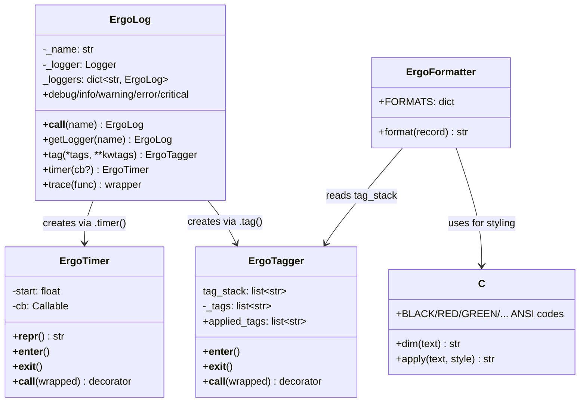

# Core — API & Architecture

## Module Structure

Single-file library: `src/ergolog/ergolog.py` contains all implementation.

## Key Behaviors

### Named/Child Loggers
- `eg('name')` → logger `ergo.name`
- `eg('name')('child')` → logger `ergo.name.child`
- `eg()` returns the root logger
- Loggers are cached in `ErgoLog._loggers`

### Tag System
- `ErgoTagger._tag_stack_var` is a `contextvars.ContextVar` — each thread and async task gets its own isolated tag stack
- Tags nest: entering a tag `set()`s a new stack, exiting `reset(token)`s to the previous snapshot
- `job` tag auto-generates `job=<6-char-hex>` on each `__enter__`
- Keyword tags render as `key=value`
- Tags are injected into `LogRecord.tags` by `ErgoFormatter.format()`
- The `set()/reset()` pattern eliminates `list.remove()` corruption bugs that occurred with a shared mutable list

### Timer
- Uses `time.time()` for wall-clock measurement
- Can be used as context manager (access elapsed via `repr(timer)`) or decorator
- Optional callback receives formatted elapsed string

### Trace Decorator
- Logs registration, arguments, and return value
- Wraps function with both `tag` and `timer`
- Equivalent to `@eg.tag(trace=func)` + `@eg.timer()`

## Invariants
- `ErgoLog._loggers` key is always the fully-qualified logger name (e.g. `ergo.sub`)
- Tag stacks are context-isolated via `contextvars.ContextVar` — no cross-thread or cross-task leakage
- `set()/reset(token)` ensures tags are always cleaned up on context exit, even on exceptions
- Color output is all-or-nothing per process (env var check at import time)