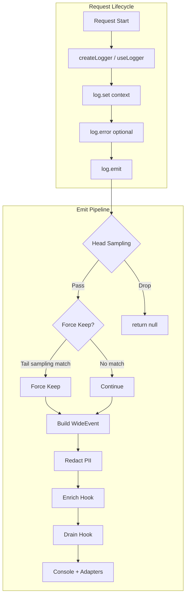

# evlog — Wide Event Logging (TypeScript)

External library analysis. evlog is a TypeScript logging library implementing the "wide event" philosophy from [LoggingSucks](https://loggingsucks.com/).

## Philosophy

Instead of scattered `console.log` calls, evlog accumulates contextual data throughout a request and emits a **single structured event** at the end:

```typescript
// Traditional (scattered)
console.log('Request received')
console.log('User:', user.id)
console.log('Payment failed')  // Hard to correlate

// evlog (wide event)
const log = useLogger(event)
log.set({ user: { id: user.id, plan: 'premium' } })
log.set({ cart: { items: 3, total: 9999 } })
log.error(error, { step: 'payment' })
// Emits ONE event with ALL context + automatic duration
```

## Architecture



## Core Types

```typescript
// The wide event - all context in one object
interface WideEvent extends BaseWideEvent {
  timestamp: string
  level: 'info' | 'error' | 'warn' | 'debug'
  service: string
  environment: string
  duration?: string      // Auto: "234ms"
  method?: string        // HTTP method
  path?: string          // HTTP path
  status?: number        // HTTP status
  requestId?: string
  error?: { name, message, stack, status, why, fix, link, internal }
  audit?: AuditFields
  // ... arbitrary user context
}

// Request-scoped logger
interface RequestLogger {
  set(context: FieldContext): void      // Merge context
  error(err: Error, context?): void      // Record error
  info(message: string, context?): void  // Add info log
  warn(message: string, context?): void  // Add warning
  emit(overrides?): WideEvent | null    // Emit and seal
  getContext(): Record<string, unknown>  // Get current context
  fork?(label: string, fn: () => Promise<void>): void  // Child logger
  audit?(input: AuditInput): void       // Record audit event
}
```

## Key Features

### Logger Sealing

After `emit()`, the logger is **sealed**. Further mutations log warnings:

```typescript
log.set({ user: { id: '123' } })
log.emit()
log.set({ ignored: true })  // [evlog] log.set() called after emit — ignored
```

This prevents data loss from fire-and-forget async work. Use `log.fork()` for intentional background tasks.

### Sampling

**Head sampling** (random, per-level):
```typescript
initLogger({
  sampling: {
    rates: { info: 10, warn: 50, debug: 0, error: 100 },  // percentages
  },
})
```

**Tail sampling** (force-keep by outcome):
```typescript
initLogger({
  sampling: {
    keep: [
      { status: 400 },       // Keep errors
      { duration: 1000 },    // Keep slow requests
      { path: '/api/**' },   // Keep critical paths
    ],
  },
})
```

### Structured Errors

```typescript
throw createError({
  message: 'Payment failed',
  status: 402,
  why: 'Card declined by issuer',
  fix: 'Try a different payment method',
  link: 'https://docs.example.com/payments',
  internal: { gatewayCode: 'DECLINED' },  // Backend only, never in response
})
```

### Audit Trail

```typescript
log.audit({
  action: 'invoice.refund',
  actor: { type: 'user', id: user.id },
  target: { type: 'invoice', id: 'inv_889' },
  outcome: 'success',
  changes: auditDiff(before, after),  // JSON Patch diff
})

// AuthZ-denied actions (often forgotten)
log.audit.deny('Insufficient permissions', { action: 'admin.delete' })
```

Tamper-evident chains:
```typescript
initLogger({
  drain: signed(createFsDrain({ dir: '.audit' }), { strategy: 'hash-chain' }),
})
```

### Drain Pipeline

Batching + retry + backoff:

```typescript
const pipeline = createDrainPipeline({
  batch: { size: 50, intervalMs: 5000 },
  retry: { maxAttempts: 3, backoff: 'exponential' },
  onDropped: (events, error) => console.error(`Dropped ${events.length}`),
})

const drain = pipeline(createAxiomDrain())
nitroApp.hooks.hook('evlog:drain', drain)
```

### Redaction

Auto-PII scrubbing:
```typescript
initLogger({
  redact: {
    paths: ['user.email', 'headers.authorization'],
    builtins: ['email', 'creditCard', 'ipv4', 'phone', 'jwt', 'bearer', 'iban'],
  },
})
```

## Framework Integrations

| Framework | Integration | Logger Access |
|-----------|-------------|---------------|
| Nuxt | `modules: ['evlog/nuxt']` | `useLogger(event)` |
| Nitro v2/v3 | Module | `useLogger(event)` |
| Express | `app.use(evlog())` | `req.log` / `useLogger()` |
| Fastify | `app.register(evlog)` | `request.log` / `useLogger()` |
| Hono | `app.use(evlog())` | `c.get('log')` / `useLogger()` |
| Elysia | `.use(evlog())` | `({ log })` / `useLogger()` |
| NestJS | `EvlogModule.forRoot()` | `useLogger()` |
| Next.js | `createEvlog({})` | `withEvlog()` |
| SvelteKit | `handle + handleError` | `event.locals.log` |
| React Router | `evlog()` middleware | `context.get(loggerContext)` |
| Cloudflare Workers | Manual setup | `createWorkersLogger(request)` |

## Hooks

```typescript
// Tail sampling hook
nitroApp.hooks.hook('evlog:emit:keep', (ctx) => {
  if (ctx.context.user?.premium) ctx.shouldKeep = true
})

// Enrichment hook (after emit, before drain)
nitroApp.hooks.hook('evlog:enrich', (ctx) => {
  ctx.event.deploymentId = process.env.DEPLOYMENT_ID
})

// Drain hook (send to external services)
nitroApp.hooks.hook('evlog:drain', async (ctx) => {
  await fetch('https://api.axiom.co/v1/datasets/logs/ingest', {
    method: 'POST',
    body: JSON.stringify([ctx.event]),
  })
})
```

## Adapters

Built-in drain adapters:

- `evlog/axiom` — Axiom
- `evlog/otlp` — OpenTelemetry Protocol (Grafana, Honeycomb, Datadog)
- `evlog/datadog` — Datadog
- `evlog/posthog` — PostHog
- `evlog/sentry` — Sentry
- `evlog/better-stack` — Better Stack
- `evlog/hyperdx` — HyperDX
- `evlog/fs` — Filesystem

## Comparison with ergolog

| Aspect | evlog | ergolog |
|--------|-------|----------|
| **Language** | TypeScript/Node.js | Python |
| **Model** | Accumulate → single emit | Per-call logging with tags |
| **Context Scope** | Request-scoped logger | `contextvars` tag stack |
| **Sealing** | Yes (prevents post-emit mutations) | No |
| **Sampling** | Head + tail sampling | None |
| **Audit** | First-class with hash chains | None |
| **Errors** | `EvlogError` with why/fix/link | Standard Python errors |
| **Drains** | Multiple adapters | Python logging handlers |
| **Async Safety** | `AsyncLocalStorage` | `contextvars` |

## Relevant Patterns for ergolog

1. **Logger sealing** — Consider adding a seal mechanism to prevent context mutation after emit.

2. **Audit trail** — The `audit` field with hash-chain signing is a complete audit solution.

3. **Structured errors** — `why`, `fix`, `link` fields make errors actionable.

4. **Tail sampling** — Force-keep based on outcome (status >= 400, duration > threshold) could reduce volume while keeping important logs.

5. **Redaction built-ins** — Pre-built PII patterns (email, credit card, etc.) reduce configuration burden.

## Source

- Repository: https://github.com/HugoRCD/evlog
- Version analyzed: 2.14.0
- Documentation: https://evlog.dev